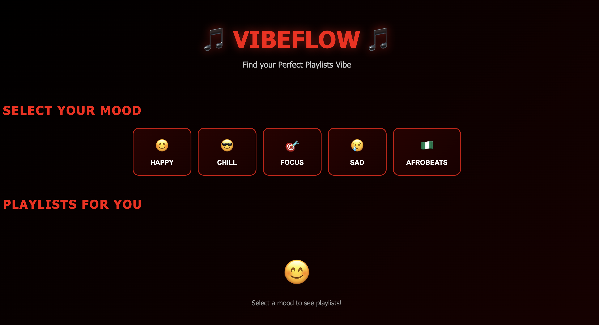
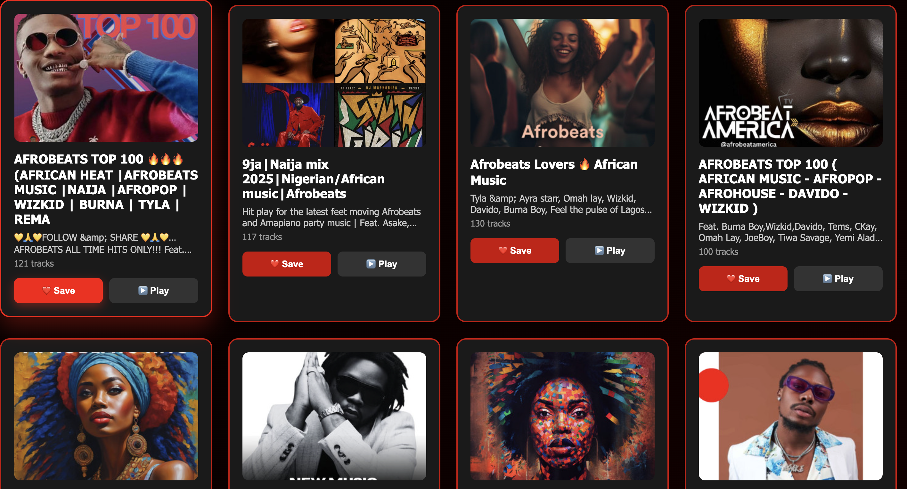
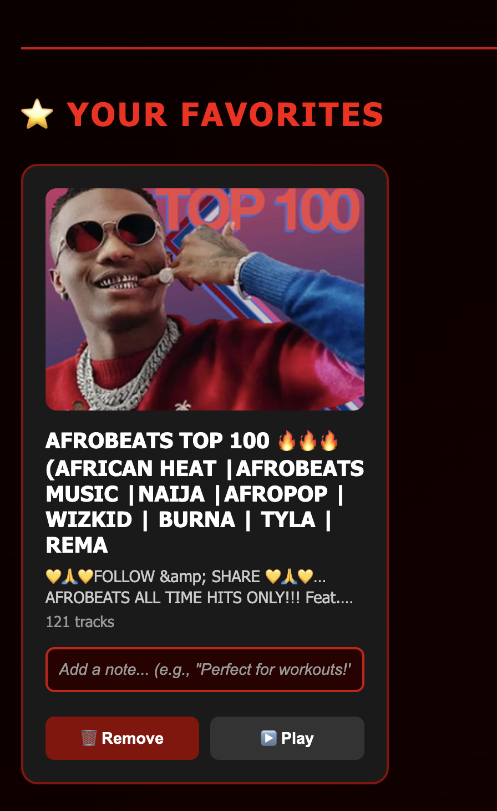

# 🎵 VibeFlow

> **Discover Your Perfect Playlist Vibe**

A full-stack music discovery web application that integrates with Spotify’s API to recommend playlists based on your current mood. Save favorites, add personal notes, and seamlessly play playlists directly in Spotify.


-----

## 📋 Table of Contents

- [Features](#-features)
- [Tech Stack](#-tech-stack)
- [Architecture](#-architecture)
- [Getting Started](#-getting-started)
- [Project Structure](#-project-structure)
- [API Documentation](#-api-documentation)
- [Environment Variables](#-environment-variables)
- [Usage Guide](#-usage-guide)
- [Development](#-development)
- [Screenshots](#-screenshots)
- [Roadmap](#-roadmap)
- [Contributing](#-contributing)
- [License](#-license)
- [Contact](#-contact)

-----

## ✨ Features

### Core Functionality

- 🎭 **Mood-Based Discovery** - Search playlists by 5 different moods (Happy, Chill, Focus, Sad, Afrobeats)
- 🎵 **Spotify Integration** - Real-time playlist data from Spotify’s API
- ❤️ **Favorites System** - Save playlists to your personal collection
- 📝 **Personal Notes** - Add custom notes to saved playlists
- ▶️ **Direct Playback** - Open playlists directly in Spotify
- 🔄 **Real-Time Updates** - Auto-save notes as you type

### User Experience

- 🎨 **Custom Theme** - Striking red/black gradient design
- 📱 **Fully Responsive** - Seamless experience across desktop, tablet, and mobile
- ⚡ **Fast Loading** - Optimized with Vite for instant feedback
- 🎯 **Intuitive UI** - Clean, modern interface with hover effects
- 🌀 **Loading States** - Smooth animations during data fetches
- 🚨 **Error Handling** - User-friendly error messages

-----
## 🛠️ Tech Stack

### Frontend

|Technology|Version|Purpose                                       |
|----------|-------|----------------------------------------------|
|**React** |18.x   |UI library for building interactive components|
|**Vite**  |5.x    |Fast build tool with instant HMR              |
|**Axios** |1.x    |Promise-based HTTP client                     |
|**CSS3**  |-      |Custom styling with Grid, Flexbox, animations |

### Backend

|Technology |Version|Purpose                          |
|-----------|-------|---------------------------------|
|**Node.js**|21.7.3 |JavaScript runtime environment   |
|**Express**|4.x    |Web application framework        |
|**Axios**  |1.x    |HTTP client for Spotify API calls|
|**CORS**   |2.x    |Cross-origin resource sharing    |
|**dotenv** |16.x   |Environment variable management  |

### External APIs

- **Spotify Web API** - OAuth 2.0 Client Credentials Flow

-----

## 🏗️ Architecture

### System Overview

```
┌─────────────┐      HTTP/REST      ┌─────────────┐      HTTP/REST      ┌─────────────┐
│             │ ──────────────────> │             │ ──────────────────> │             │
│   Browser   │                     │   Express   │                     │   Spotify   │
│  (React UI) │ <────────────────── │   Backend   │ <────────────────── │     API     │
│             │      JSON Data      │             │      JSON Data      │             │
└─────────────┘                     └─────────────┘                     └─────────────┘
     Port:                               Port:                         OAuth 2.0
     5173                                3000                    Client Credentials
```

### Data Flow

1. **User Action** → Click mood button (e.g., “Happy”)
1. **Frontend** → Sends GET request to backend
1. **Backend** → Authenticates with Spotify, fetches playlists
1. **Spotify API** → Returns playlist data
1. **Backend** → Formats and sends to frontend
1. **Frontend** → Renders playlist cards
1. **User** → Saves favorite, adds note
1. **Backend** → Stores in-memory (favorites array)

-----

## 🚀 Getting Started

### Prerequisites

- **Node.js** (v21.7.3 or higher)
- **npm** (comes with Node.js)
- **Spotify Developer Account** (free)

### Installation

#### 1️⃣ Clone Repository

```bash
git clone https://github.com/woleadeoshun10/VibeFlow.git
cd VibeFlow
```

#### 2️⃣ Setup Backend

```bash
# Navigate to backend directory
cd backend

# Install dependencies
npm install

# Create .env file
touch .env
```

Add to `.env`:

```env
PORT=3000
SPOTIFY_CLIENT_ID=your_spotify_client_id
SPOTIFY_CLIENT_SECRET=your_spotify_client_secret
```

#### 3️⃣ Setup Frontend

```bash
# Navigate to frontend directory (from project root)
cd ../frontend

# Install dependencies
npm install
```

#### 4️⃣ Get Spotify Credentials

1. Go to [Spotify Developer Dashboard](https://developer.spotify.com/dashboard)
1. Log in with your Spotify account
1. Click **“Create App”**
1. Fill in:
- **App Name**: VibeFlow
- **App Description**: Music discovery app
- **Redirect URI**: `http://localhost:3000` (for local testing)
1. Copy **Client ID** and **Client Secret**
1. Paste into backend `.env` file

-----

## 📁 Project Structure

```
vibeflow/
│
├── backend/
│   ├── node_modules/
│   ├── .env                    # Environment variables (not in git)
│   ├── .gitignore
│   ├── package.json
│   ├── package-lock.json
│   └── server.js               # Express server + API routes
│
└── frontend/
    ├── node_modules/
    ├── public/
    ├── src/
    │   ├── App.jsx             # Main React component
    │   ├── App.css             # Component styles
    │   ├── index.css           # Global styles
    │   └── main.jsx            # React entry point
    ├── index.html              # HTML shell
    ├── .gitignore
    ├── package.json
    ├── package-lock.json
    └── vite.config.js          # Vite configuration
```

-----

## 📡 API Documentation

### Base URL

```
http://localhost:3000/api
```

### Endpoints

#### 1. Get Playlists by Mood

```http
GET /api/playlists/:mood
```

**Parameters:**

|Name|Type  |Required|Description                                          |
|----|------|--------|-----------------------------------------------------|
|mood|string|Yes     |One of: `happy`, `chill`, `focus`, `sad`, `afrobeats`|

**Response:**

```json
{
  "mood": "happy",
  "playlists": [
    {
      "id": "37i9dQZF1DXdPec7aLTmlC",
      "name": "Happy Hits!",
      "description": "Hits to boost your mood and fill you with happiness!",
      "image": "https://i.scdn.co/image/ab67706f00000002...",
      "totalTracks": 143,
      "spotifyUrl": "https://open.spotify.com/playlist/37i9dQZF1DXdPec7aLTmlC"
    }
    // ... 11 more playlists
  ]
}
```

**Error Response:**

```json
{
  "error": "Invalid mood. Choose: happy, chill, focus, sad, or afrobeats"
}
```

-----

#### 2. Get All Favorites

```http
GET /api/favorites
```

**Response:**

```json
{
  "favorites": [
    {
      "id": "37i9dQZF1DXdPec7aLTmlC",
      "name": "Happy Hits!",
      "description": "Hits to boost your mood...",
      "image": "https://...",
      "totalTracks": 143,
      "spotifyUrl": "https://...",
      "userNote": "Perfect for morning workouts!"
    }
  ]
}
```

-----

#### 3. Add to Favorites

```http
POST /api/favorites
```

**Request Body:**

```json
{
  "playlist": {
    "id": "37i9dQZF1DXdPec7aLTmlC",
    "name": "Happy Hits!",
    "description": "Hits to boost your mood...",
    "image": "https://...",
    "totalTracks": 143,
    "spotifyUrl": "https://..."
  }
}
```

**Response:**

```json
{
  "message": "Added to favorites",
  "favorites": [/* updated favorites array */]
}
```

**Error Response:**

```json
{
  "error": "Playlist already in favorites"
}
```

-----

#### 4. Update Favorite Note

```http
PATCH /api/favorites/:id
```

**Parameters:**

|Name|Type  |Required|Description        |
|----|------|--------|-------------------|
|id  |string|Yes     |Spotify playlist ID|

**Request Body:**

```json
{
  "userNote": "Great for gym sessions!"
}
```

**Response:**

```json
{
  "message": "Note added.",
  "favorites": [/* updated favorites array */]
}
```

-----

#### 5. Remove from Favorites

```http
DELETE /api/favorites/:id
```

**Parameters:**

|Name|Type  |Required|Description        |
|----|------|--------|-------------------|
|id  |string|Yes     |Spotify playlist ID|

**Response:**

```json
{
  "message": "Removed from favorites",
  "favorites": [/* updated favorites array */]
}
```

-----

#### 6. Health Check

```http
GET /api/health
```

**Response:**

```json
{
  "status": "Server is running 🚀"
}
```

-----

## 🔐 Environment Variables

### Backend `.env`

```env
# Server Configuration
PORT=3000

# Spotify API Credentials
SPOTIFY_CLIENT_ID=your_client_id_here
SPOTIFY_CLIENT_SECRET=your_client_secret_here
```

⚠️ **Security Notes:**

- Never commit `.env` to version control
- Add `.env` to `.gitignore`
- Use different credentials for production
- Rotate secrets regularly

-----

## 📖 Usage Guide

### Starting the Application

#### 1️⃣ Start Backend Server

```bash
# In backend directory
cd backend
npm start
```

**Expected Output:**

```
✅ Spotify token obtained successfully
🎵 VibeFlow Backend running on http://localhost:3000
API endpoints ready
```

#### 2️⃣ Start Frontend Development Server

```bash
# In frontend directory (new terminal)
cd frontend
npm run dev
```

**Expected Output:**

```
VITE v5.x.x  ready in 234 ms

➜  Local:   http://localhost:5173/
➜  Network: use --host to expose
```

#### 3️⃣ Access Application

Open browser and navigate to:

```
http://localhost:5173
```

-----

### User Workflow

#### Discovering Playlists

1. **Select a Mood** - Click one of 5 mood buttons
1. **View Results** - See 12 curated playlists
1. **Preview Details** - Hover over cards for lift effect
1. **Save Favorites** - Click ❤️ Save button
1. **Play in Spotify** - Click ▶️ Play button

#### Managing Favorites

1. **View Favorites** - Scroll down to ⭐ Your Favorites section
1. **Add Notes** - Type in the input box (auto-saves)
1. **View Notes** - See saved notes displayed below input
1. **Remove** - Click 🗑️ Remove button
1. **Play** - Click ▶️ Play button to open in Spotify

-----

## 👨‍💻 Development

### Available Scripts

#### Backend

```bash
npm start          # Start server on port 3000
npm run dev        # Start with nodemon (auto-restart)
```

#### Frontend

```bash
npm run dev        # Start Vite dev server (port 5173)
npm run build      # Build for production
npm run preview    # Preview production build
```

### Code Style

- **React**: Functional components with Hooks
- **JavaScript**: ES6+ syntax (arrow functions, async/await)
- **CSS**: BEM-like naming convention
- **Comments**: Inline explanations for complex logic

### Git Workflow

```bash
# Create feature branch
git checkout -b feature/your-feature-name

# Make changes and commit
git add .
git commit -m "Add: description of changes"

# Push to remote
git push origin feature/your-feature-name

# Create Pull Request on GitHub
```

### Commit Message Convention

```
Add: New feature
Fix: Bug fix
Update: Refactoring/improvements
Docs: Documentation changes
Style: Code formatting
```

-----

## 📸 Screenshots

### Main Interface

*(Screenshot: Homepage with mood selector)*



### Playlist Results

*(Screenshot: Grid of playlist cards)*



### Favorites Section

*(Screenshot: Favorites with notes)*


### Mobile View

*(Screenshot: Responsive mobile layout)*


### Ipad View

*(Screenshot: Responsive Ipad layout)*


-----

## 🗺️ Roadmap

### Version 1.0 (Current) ✅

- [x] Mood-based playlist search
- [x] Favorites with notes
- [x] Spotify playback integration
- [x] Responsive design
- [x] Error handling

### Version 1.1 (Planned)

- [ ] User authentication (login/signup)
- [ ] Persistent database (MongoDB)
- [ ] Search within favorites
- [ ] Sort/filter playlists
- [ ] Dark/light mode toggle

### Version 2.0 (Future)

- [ ] Social features (share favorites)
- [ ] Playlist analytics
- [ ] Custom mood creation
- [ ] Mobile app (React Native)
- [ ] Spotify Premium integration (direct playback)

-----

## 📄 License

This project is licensed under the **MIT License** - see the <LICENSE> file for details.

```
MIT License

Copyright (c) 2025 ADEWOLE ADEOSHUN

Permission is hereby granted, free of charge, to any person obtaining a copy
of this software and associated documentation files (the "Software"), to deal
in the Software without restriction, including without limitation the rights
to use, copy, modify, merge, publish, distribute, sublicense, and/or sell
copies of the Software, and to permit persons to whom the Software is
furnished to do so, subject to the following conditions:

The above copyright notice and this permission notice shall be included in all
copies or substantial portions of the Software.

THE SOFTWARE IS PROVIDED "AS IS", WITHOUT WARRANTY OF ANY KIND, EXPRESS OR
IMPLIED, INCLUDING BUT NOT LIMITED TO THE WARRANTIES OF MERCHANTABILITY,
FITNESS FOR A PARTICULAR PURPOSE AND NONINFRINGEMENT. IN NO EVENT SHALL THE
AUTHORS OR COPYRIGHT HOLDERS BE LIABLE FOR ANY CLAIM, DAMAGES OR OTHER
LIABILITY, WHETHER IN AN ACTION OF CONTRACT, TORT OR OTHERWISE, ARISING FROM,
OUT OF OR IN CONNECTION WITH THE SOFTWARE OR THE USE OR OTHER DEALINGS IN THE
SOFTWARE.
```

-----
## 🙏 Acknowledgments

- [Spotify Web API](https://developer.spotify.com/documentation/web-api) - For comprehensive music data
- [React Documentation](https://react.dev) - For excellent learning resources
- [Vite](https://vitejs.dev) - For blazing-fast development experience
- [Axios](https://axios-http.com) - For simplified HTTP requests
- Color scheme inspired by Apple Music’s branding

-----

<div align="center">

### ⭐ Star this repo if you find it helpful! ⭐

**Built with ❤️ and 🎵 by Adewole**

[⬆ Back to Top](#-vibeflow)

</div>
